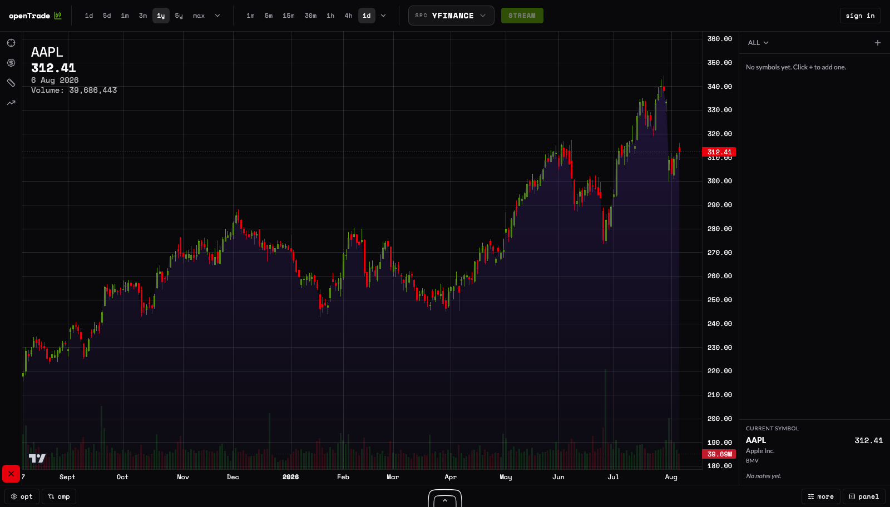

# OpenTrade

OpenTrade is a self-hosted research workspace for charting market data, exploring indicators and analytics, and running reproducible backtests and portfolio simulations.



> [!IMPORTANT]
> **Project status: pre-release alpha.** OpenTrade is under active development. Expect breaking changes, incomplete workflows, and no guaranteed upgrade path until the first tagged release. The `amd64` and `arm64` acceptance tests are still release blockers.

Use OpenTrade to:

- chart OHLCV data from Yahoo Finance, Binance, Twelve Data, or your own CSV files;
- compare instruments and explore technical indicators, risk, and distribution analytics;
- write and run research scripts and backtests; and
- save accounts, provider credentials, strategies, and run history locally.

> [!WARNING]
> OpenTrade is educational and research software, not investment advice or a brokerage. It does not place trades. Backtests and simulated results do not guarantee future performance. Market data may be delayed, incomplete, or inaccurate; verify important information with an authoritative source before making financial decisions.

## Quick start

1. Install [Docker Desktop](https://docs.docker.com/desktop/) (or Docker Engine with the Compose plugin on Linux).
2. [Download this repository](https://github.com/AlexAlexBabarika/openTrade/archive/refs/heads/main.zip) and extract it, or clone it:

   ```bash
   git clone https://github.com/AlexAlexBabarika/openTrade.git
   cd openTrade
   ```

3. Start OpenTrade from the project directory:

   ```bash
   docker compose up -d
   ```

4. Wait until both services are healthy, then open [http://localhost:8000](http://localhost:8000):

   ```bash
   docker compose ps
   ```

No `.env` file, provider key, or PostgreSQL administration is needed for the default experience. OpenTrade generates unique application secrets on first boot and keeps them across restarts.

## What you need

| Requirement | Support |
| --- | --- |
| Operating system | Current macOS or Windows with Docker Desktop; Linux with Docker Engine and Compose v2 |
| CPU architecture | `linux/amd64` and `linux/arm64` are intended targets; formal clean-machine validation is still pending |
| Memory | 4 GB available to Docker recommended; a formal minimum has not been benchmarked |
| Disk | 2 GB free recommended for images and initial data, plus space for uploaded and generated datasets |
| Browser | A current desktop browser |
| Network | Required to download/build the containers and for Yahoo Finance, Binance, and Twelve Data; not required after startup when working only with local CSV data |

Docker support ultimately depends on the [platforms supported by Docker](https://docs.docker.com/desktop/setup/install/). OpenTrade currently binds to `127.0.0.1`, so other devices on your network cannot connect by default.

## Data providers

| Provider | Credentials | Internet | Notes |
| --- | --- | --- | --- |
| Yahoo Finance (through `yfinance`) | None | Required | Stocks, ETFs, currencies, and crypto. This is an unofficial integration intended for research/personal use; review [Yahoo's terms](https://legal.yahoo.com/us/en/yahoo/terms/otos/index.html). Yahoo does not publish a stable API quota, so requests may be throttled. |
| Binance | None for public market data; a user-owned key is optional | Required | Crypto pairs and live public streams. Limits are IP- and request-weight-based; see the [official API limits](https://developers.binance.com/docs/binance-spot-api-docs/rest-api/limits) and [terms](https://www.binance.com/en/terms). Availability varies by jurisdiction. |
| Twelve Data | User-owned API key and an OpenTrade account | Required | Add the key inside OpenTrade's API key settings. Allowances depend on the subscription; see [pricing/rate limits](https://twelvedata.com/pricing) and [terms](https://twelvedata.com/terms). |
| CSV | None | No | The file is uploaded to your local OpenTrade server. CSV uploads default to a 10 MiB maximum. |

OpenTrade also enforces its own shared market-data limit of 120 requests per 60 seconds by default. Provider limits still apply independently.

## Everyday operations

Run these commands from the repository directory.

### Start, stop, and inspect

```bash
docker compose up -d
docker compose stop
docker compose start
docker compose ps
docker compose logs -f opentrade
```

`stop`, `start`, and `docker compose down` preserve accounts, saved keys, generated secrets, and database data in Docker volumes. Press `Ctrl+C` to stop following logs.
Compose rotates each service's local logs at 10 MiB and retains three files, so
routine access and health-check logs cannot grow without bound.

### Update

The project is currently pre-release. Ordered database migrations run automatically when the updated app starts, but rollback compatibility is not yet guaranteed. Back up first, review the [release notes](https://github.com/AlexAlexBabarika/openTrade/releases), then rebuild from the checked-out revision:

```bash
git pull --ff-only
docker compose up -d --build
```

### Back up

This creates a PostgreSQL dump and copies the application data (including the encryption secrets needed by saved provider keys) into `backup/`:

```bash
mkdir -p backup/app-data
docker compose exec -T postgres sh -c 'pg_dump -U "$POSTGRES_USER" -d "$POSTGRES_DB" --clean --if-exists' > backup/opentrade.sql
docker compose cp opentrade:/app/data/. backup/app-data
```

Protect the backup: it contains account data and the key material that protects saved provider credentials.

### Restore

Restore only into a compatible OpenTrade revision. These commands replace the current database contents with the dump:

```bash
docker compose up -d
docker compose exec -T postgres sh -c 'psql -U "$POSTGRES_USER" -d "$POSTGRES_DB"' < backup/opentrade.sql
docker compose cp backup/app-data/. opentrade:/app/data
docker compose restart opentrade
```

### Reset all data

> [!CAUTION]
> This permanently deletes all OpenTrade accounts, saved API keys, generated secrets, PostgreSQL data, and application data. It cannot be undone without a backup.

```bash
docker compose down --volumes
```

### Uninstall

To remove the containers and locally built image while preserving data:

```bash
docker compose down --rmi local
```

To uninstall OpenTrade **and permanently delete its data**:

```bash
docker compose down --volumes --rmi local
```

You can then delete the downloaded repository directory.

## Configuration

Configuration is optional for local use. Copy `env.example` to `.env` only when overriding a default. Byte values are positive integers; comma-separated lists must not contain `*`.

| Variable | Purpose | Default | Allowed format | Secret? | Required when |
| --- | --- | --- | --- | --- | --- |
| `OPENTRADE_PORT` | Local browser port | `8000` | TCP port | No | Only to change the port |
| `POSTGRES_DB` | Database name | `opentrade` | PostgreSQL identifier | No | Never |
| `POSTGRES_USER` | Database user | `opentrade` | PostgreSQL identifier | No | Never |
| `POSTGRES_PASSWORD` | Database password | `opentrade` | String | Yes | Only when overriding the local default |
| `JWT_SECRET` | Signs authentication tokens | Generated and persisted | At least 32 characters | Yes | Only for externally managed secrets |
| `API_KEYS_ENCRYPTION_KEY` | Encrypts saved provider keys | Generated and persisted | Exactly 64 hexadecimal characters | Yes | Only for externally managed secrets; retain across restore/upgrade |
| `COOKIE_SECURE` | Adds the cookie `Secure` flag | `0` | `0` or `1` | No | Set to `1` for HTTPS/internet exposure |
| `COOKIE_SAMESITE` | Refresh-cookie cross-site policy | `lax` | `lax`, `strict`, or `none` | No | `none` requires `COOKIE_SECURE=1` |
| `CORS_ORIGINS` | Permitted separate frontend origins | Empty (same-origin only) | Comma-separated origins | No | Only for a separate frontend |
| `ALLOWED_HOSTS` | Accepted HTTP hostnames | `localhost,127.0.0.1` | Comma-separated hostnames | No | Add every reverse-proxy/public hostname |
| `MAX_UPLOAD_BYTES` | Maximum CSV upload | `10485760` | Positive bytes | No | Never |
| `MAX_REQUEST_BYTES` | Maximum HTTP request body | `12582912` | Positive bytes, at least upload limit | No | Never |
| `WS_MAX_MESSAGE_BYTES` | Maximum WebSocket message | `65536` | Positive bytes | No | Never |
| `WS_MAX_CONNECTIONS_PER_IP` | WebSocket connection cap per address | `20` | Positive integer | No | Never |
| `WS_MAX_MESSAGES_PER_MINUTE` | WebSocket message cap per connection | `120` | Positive integer | No | Never |
| `WS_MAX_SUBSCRIPTIONS` | Active subscriptions per socket | `20` | Positive integer | No | Never |
| `MAX_CONCURRENT_SWEEPS` | Concurrent optimization sweeps | `2` | Positive integer | No | Never |
| `MAX_MARKET_OHLCV_CANDLES` | Maximum candles per market response | `8000` | Integer of at least `100` | No | Never |
| `MARKET_RATE_LIMIT_MAX` | Market requests allowed per window | `120` | Positive integer | No | Never |
| `MARKET_RATE_LIMIT_WINDOW_SEC` | Market rate-limit window | `60` | Positive number of seconds | No | Never |
| `SEED_SYMBOLS_ON_STARTUP` | Refresh provider symbol catalogs after startup | `1` in Compose | `0` or `1` | No | Set to `0` to disable |
| `SYMBOL_SEED_PROVIDERS` | Catalogs refreshed at startup | `binance` | Comma-separated `binance`, `twelvedata` | No | Twelve Data also needs `TWELVEDATA_API_KEY` |
| `TWELVEDATA_API_KEY` | Operator key used only by the startup catalog seeder | Empty | Twelve Data API key | Yes | Only when startup seeding includes `twelvedata` |

`DATABASE_URL` and `OPENTRADE_SECRETS_FILE` are wired internally by Compose and normally should not be overridden. For an internet-facing deployment, use an HTTPS reverse proxy, enable secure cookies, set explicit allowed hosts, and review the [security policy](SECURITY.md).

## Data and privacy

OpenTrade has no documented telemetry. Local accounts, password hashes, refresh sessions, encrypted provider keys, preferences, and metadata live in the `postgres_data` Docker volume. Generated encryption secrets and application datasets live in `app_data`. Uploaded CSV contents and in-memory market-data caches are not sent to OpenTrade maintainers.

When you request market data, the OpenTrade backend sends the requested symbol, interval, period/time range, and ordinary network metadata such as your public IP address to the selected provider:

- Yahoo Finance receives Yahoo/yfinance market-data requests.
- Binance receives public REST or WebSocket market-data requests and, if configured, your Binance API credentials.
- Twelve Data receives market-data requests and your Twelve Data API key.
- CSV data stays between your browser and your self-hosted OpenTrade instance unless you explicitly use it in another workflow.

Each provider handles received data under its own privacy policy and terms. OpenTrade does not submit brokerage orders.

## Troubleshooting

- **The page does not open:** run `docker compose ps`; wait for both services to report `healthy`, then inspect `docker compose logs opentrade postgres`.
- **A container is unhealthy:** inspect the service's recent output with `docker compose logs --tail=200 opentrade postgres`. Configuration and migration failures are reported in the `opentrade` log; PostgreSQL storage and startup failures appear in the `postgres` log.
- **Port 8000 is occupied:** set `OPENTRADE_PORT=8001` in `.env`, restart with `docker compose up -d`, and open `http://localhost:8001`.
- **A provider fails or throttles:** check internet access, symbol/interval support, provider availability, and the provider's rate limit. Twelve Data also requires signing in and saving a valid key.
- **Saved provider keys no longer decrypt:** restore the matching `app_data` backup or the original `API_KEYS_ENCRYPTION_KEY`. Do not generate a replacement for existing encrypted keys.
- **The database is unhealthy after an update:** inspect `docker compose logs opentrade postgres`. Migrations are transactional, but restoring a compatible backup is the safest recovery path; automatic rollback is not yet supported.
- **A volume is old or corrupted:** restore a backup made from a compatible OpenTrade revision. If no data must be retained, use the destructive reset command above to recreate clean volumes. Never delete volumes as a troubleshooting step when their data is still needed.

For unresolved problems, [open a bug report](https://github.com/AlexAlexBabarika/openTrade/issues/new/choose). Report suspected vulnerabilities privately as described in [SECURITY.md](SECURITY.md).

## Project links

- [Contributing guide](CONTRIBUTING.md)
- [Security policy](SECURITY.md)
- [API documentation](http://localhost:8000/docs) (available while OpenTrade is running)
- [Releases and changelog](https://github.com/AlexAlexBabarika/openTrade/releases)
- [Issue tracker and roadmap](https://github.com/AlexAlexBabarika/openTrade/issues)
- [Apache License 2.0](LICENSE), [NOTICE](NOTICE), and [third-party notices](THIRD_PARTY_NOTICES.md)

By contributing, you agree to the [Developer Certificate of Origin process](CONTRIBUTING.md). The OpenTrade name is covered by the repository's [trademark guidance](TRADEMARKS.md).
